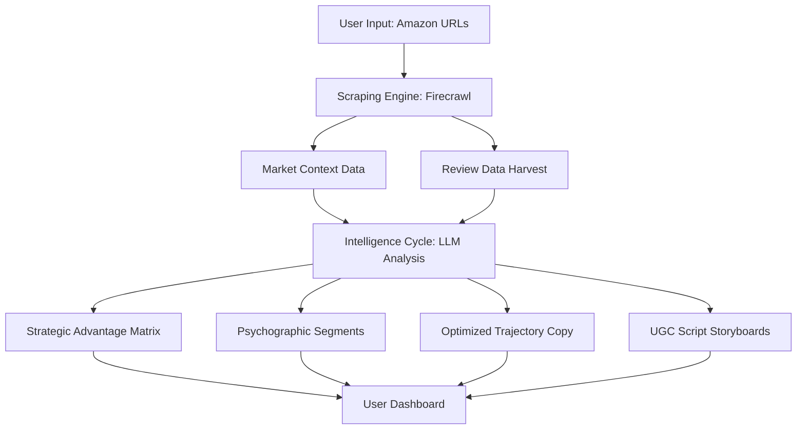

# ListingIQ 🚀

ListingIQ is a high-performance **Competitive Intelligence Engine** designed for Amazon sellers and brand owners. It leverages AI to analyze competitor listings and customer reviews, identifying strategic gaps and generating high-converting marketing assets in seconds.

## 🌟 Key Features

- **Strategic Advantage Matrix:** Head-to-head comparison of market claims against your brand.
- **Psychographic Market Segments:** Deep-dive analysis of customer sentiment and emotional drivers.
- **Market-Closing Updates:** AI-optimized bullet points designed to neutralize competitor advantages.
- **UGC Content Architect:** Data-backed storyboards and scripts for short-form video (TikTok/Reels).

## 🏗️ System Architecture

The following diagram illustrates how ListingIQ operates on a broader level:



## 🛠️ Tech Stack

- **Frontend:** Next.js 15+, TypeScript, Tailwind CSS 4.0
- **UI Components:** Radix UI (Base UI), Lucide Icons, Framer Motion
- **AI Engine:** Groq SDK (Llama-3 models) 
- **Data Acquisition:** Firecrawl API (Optimized for marketplace scraping)

## 🚀 Getting Started

### Prerequisites

- Node.js 20+ 
- Firecrawl API Key
- Groq API Key (or Google AI Key)

### Installation

1. **Clone the repository:**
   ```bash
   git clone https://github.com/your-username/listingiq.git
   cd listingiq
   ```

2. **Install dependencies:**
   ```bash
   npm install
   ```

3. **Environment Setup:**
   Create a `.env.local` file in the root directory and add your keys:
   ```env
   FIRECRAWL_API_KEY=your_firecrawl_key
   GROQ_API_KEY=your_groq_key
   # Optional: NEXT_PUBLIC_...
   ```

4. **Run Development Server:**
   ```bash
   npm run dev
   ```

## 📋 Operational Workflow

1. **Input:** Provide the URL of your Amazon listing and up to 3 major competitor URLs.
2. **Scrape:** Firecrawl bypasses marketplace bot detection to extract product features and the latest 20 helpful reviews.
3. **Analyze:** Our AI models map market assertions, identify feature vulnerabilities, and cluster customer personas.
4. **Deploy:** Export optimized listing copy or download UGC storyboards to hand over to content creators.

## 🛡️ Security

- Secrets and environment variables are protected via `.gitignore`.
- Analysis is performed in real-time; listing data is processed according to strict privacy protocols.

---

*© 2026 ListingIQ Precision Analytics. Terminal Session Terminated.*
